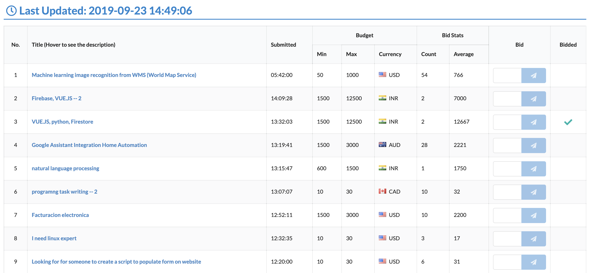

# FLMonitor

A simple React app to monitor projects on [freelancer.com](https://www.freelancer.com).

## Why created this app?

The most important thing to win a project on [freelancer.com](https://www.freelancer.com) is **BID FASTER**.

## Getting Started

1. Rename `config.example.js` to `config.js` and fill out the required parameters.
1. Run `npm start`

## Freelancer API Document

https://developers.freelancer.com/docs
